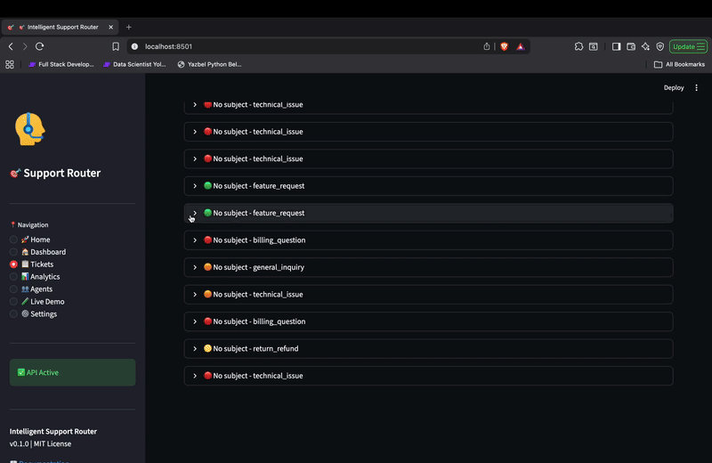

# 🎯 SupportIQ - Intelligent Support Router

> Open-source AI-powered customer support ticket routing system with real-time classification, sentiment analysis, and smart agent assignment.

[](https://opensource.org/licenses/MIT)
[](https://www.python.org/downloads/)
[](https://fastapi.tiangolo.com/)
[](https://www.docker.com/)

---

## 🎬 Demo

Check out the live demo video to see SupportIQ in action:

[](https://www.youtube.com/watch?v=7OxsMxskUc4)
*Click the GIF above to watch the full video with sound on YouTube*

*See how SupportIQ processes tickets, classifies issues, and generates responses in real-time.*

---

## ✨ Features

### 🤖 AI-Powered Classification

- **GPT-4 Integration** - Accurate ticket categorization powered by OpenAI
- **8 Built-in Categories** - Technical issues, billing, complaints, feature requests, and more
- **Multi-intent Detection** - Identifies multiple issues within a single ticket
- **Confidence Scoring** - Know how certain the AI is about each classification

### 💬 Deep Sentiment Analysis

- **Emotion Detection** - Positive, negative, neutral, and angry sentiments
- **Hidden Anger Detection** - Identifies frustration masked by polite language
- **Threat Assessment** - Flags potential escalations and legal threats
- **Churn Risk Indicators** - Identifies customers at risk of leaving

### 🎯 Intelligent Priority Scoring

- **Multi-factor Analysis** - Keywords, sentiment, customer tier, and category
- **Dynamic Adjustment** - Priority adapts based on context
- **VIP Detection** - Premium customers get appropriate attention
- **Urgency Keywords** - Recognizes critical and time-sensitive language

### 👥 Smart Agent Routing

- **Skill-based Matching** - Routes to agents with relevant expertise
- **Load Balancing** - Distributes tickets evenly across team
- **Availability Tracking** - Only routes to available agents
- **Experience Levels** - Complex issues go to senior agents

### 📊 Analytics Dashboard

- **Real-time Metrics** - Live ticket counts and processing rates
- **Category Distribution** - Visual breakdown of ticket types
- **Sentiment Trends** - Track customer satisfaction over time
- **Agent Performance** - Monitor workload and response times

### 🔌 Integration Ready

- **REST API** - Complete programmatic access
- **Webhook Support** - Real-time notifications
- **Zendesk Compatible** - Easy integration with existing tools
- **Freshdesk Support** - Works with popular helpdesk platforms

---

## 🚀 Quick Start

### Prerequisites

- Docker and Docker Compose
- OpenAI API key ([Get one here](https://platform.openai.com/api-keys))

### One-Command Setup

```bash
# Clone the repository
git clone https://github.com/meryemsakin/supportiq.git
cd supportiq

# Copy environment template
cp .env.example .env

# Add your OpenAI API key to .env
echo "OPENAI_API_KEY=sk-your-key-here" >> .env

# Start everything with Docker
docker compose up -d

# Wait for services to start (about 30 seconds)
sleep 30

# Load demo data (optional)
python scripts/load_demo_data.py
```

### Access Points

| Service | URL | Description |
|---------|-----|-------------|
| **Dashboard** | <http://localhost:8501> | Streamlit analytics dashboard |
| **API Docs** | <http://localhost:8000/docs> | Interactive Swagger documentation |
| **API** | <http://localhost:8000/api/v1> | REST API endpoints |

---

## 📖 How It Works

### 1. Submit a Ticket

```bash
curl -X POST http://localhost:8000/api/v1/tickets \
  -H "Content-Type: application/json" \
  -d '{
    "subject": "Payment failed but money was deducted",
    "content": "I tried to purchase a premium subscription but the payment failed. However, $49.99 was deducted from my bank account. I need this resolved immediately!",
    "customer_email": "john.smith@example.com",
    "customer_tier": "premium"
  }'
```

### 2. AI Processing

The system automatically:

| Step | Result |
|------|--------|
| 🏷️ **Classification** | `billing_question` (92% confidence) |
| 😤 **Sentiment** | `negative` (anger level: 0.7) |
| 🔥 **Priority** | `Critical` (score: 5/5) |
| 👤 **Routing** | Assigned to Senior Billing Agent |

### 3. Get Results

```json
{
  "id": "550e8400-e29b-41d4-a716-446655440000",
  "status": "processed",
  "category": "billing_question",
  "category_confidence": 0.92,
  "sentiment": "negative",
  "sentiment_score": -0.7,
  "priority": 5,
  "priority_level": "critical",
  "priority_factors": [
    "urgent_keyword",
    "negative_sentiment",
    "premium_customer",
    "billing_category"
  ],
  "assigned_agent_id": "123e4567-e89b-12d3-a456-426655440000",
  "suggested_responses": [...]
}
```

---

## 🏗️ Architecture

```
┌─────────────────────────────────────────────────────────────────┐
│                        Input Sources                             │
│  ┌──────────┐  ┌──────────┐  ┌──────────┐  ┌──────────────────┐ │
│  │  Email   │  │  Zendesk │  │Freshdesk │  │  Custom Webhook  │ │
│  └────┬─────┘  └────┬─────┘  └────┬─────┘  └────────┬─────────┘ │
└───────┼─────────────┼─────────────┼─────────────────┼───────────┘
        │             │             │                 │
        └─────────────┴──────┬──────┴─────────────────┘
                             ▼
┌─────────────────────────────────────────────────────────────────┐
│                     FastAPI Application                          │
│  ┌─────────────────────────────────────────────────────────────┐│
│  │                    AI Processing Pipeline                    ││
│  │  ┌──────────┐  ┌──────────┐  ┌──────────┐  ┌─────────────┐ ││
│  │  │Classifier│→ │Sentiment │→ │ Priority │→ │   Router    │ ││
│  │  │  (GPT-4) │  │ Analyzer │  │  Scorer  │  │   Engine    │ ││
│  │  └──────────┘  └──────────┘  └──────────┘  └─────────────┘ ││
│  └─────────────────────────────────────────────────────────────┘│
│  ┌─────────────────────────────────────────────────────────────┐│
│  │                   Knowledge Base (RAG)                       ││
│  │           ChromaDB Vector Database + OpenAI Embeddings       ││
│  └─────────────────────────────────────────────────────────────┘│
└─────────────────────────────────────────────────────────────────┘
                             │
        ┌────────────────────┼────────────────────┐
        ▼                    ▼                    ▼
┌──────────────┐    ┌──────────────┐    ┌──────────────┐
│  PostgreSQL  │    │    Redis     │    │   Celery     │
│   Database   │    │    Cache     │    │   Workers    │
└──────────────┘    └──────────────┘    └──────────────┘
```

---

## 🔧 Configuration

### Environment Variables

| Variable | Description | Required | Default |
|----------|-------------|----------|---------|
| `OPENAI_API_KEY` | OpenAI API key | ✅ Yes | - |
| `DATABASE_URL` | PostgreSQL connection | No | `postgresql://...` |
| `REDIS_URL` | Redis connection | No | `redis://localhost:6379` |
| `DEFAULT_LANGUAGE` | Default processing language | No | `en` |
| `LOG_LEVEL` | Logging verbosity | No | `INFO` |

### Ticket Categories

| Category | Description |
|----------|-------------|
| `technical_issue` | Technical problems, errors, and system issues |
| `billing_question` | Payment, invoices, and pricing inquiries |
| `feature_request` | New feature suggestions and improvements |
| `bug_report` | Software defects and unexpected behavior |
| `account_management` | Account settings, passwords, and profiles |
| `return_refund` | Return and refund requests |
| `general_inquiry` | General questions and information |
| `complaint` | Customer complaints and negative feedback |

---

## 🧪 Testing

```bash
# Run all tests
pytest

# Run with coverage report
pytest --cov=src --cov-report=html

# Run specific test suite
pytest tests/unit/test_classifier.py -v

# Run integration tests
pytest tests/integration/ -v
```

---

## 📁 Project Structure

```
supportiq/
├── src/
│   ├── api/              # API routes and endpoints
│   ├── models/           # Database models
│   ├── schemas/          # Pydantic schemas
│   ├── services/         # AI services (classifier, sentiment, etc.)
│   └── utils/            # Helper utilities
├── frontend/             # Streamlit dashboard
├── tests/                # Unit and integration tests
├── scripts/              # Utility scripts
├── docs/                 # Documentation
└── docker-compose.yml    # Docker configuration
```

---

## 🤝 Contributing

We welcome contributions! Here's how to get started:

1. **Fork** the repository
2. **Create** a feature branch (`git checkout -b feature/amazing-feature`)
3. **Commit** your changes (`git commit -m 'Add amazing feature'`)
4. **Push** to the branch (`git push origin feature/amazing-feature`)
5. **Open** a Pull Request

---

## 📄 License

This project is licensed under the MIT License - see the [LICENSE](LICENSE) file for details.

---
